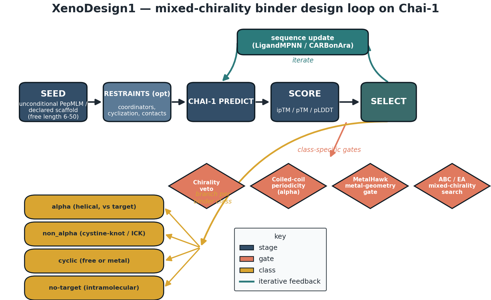
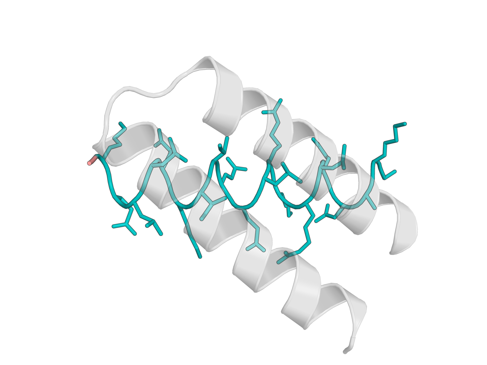
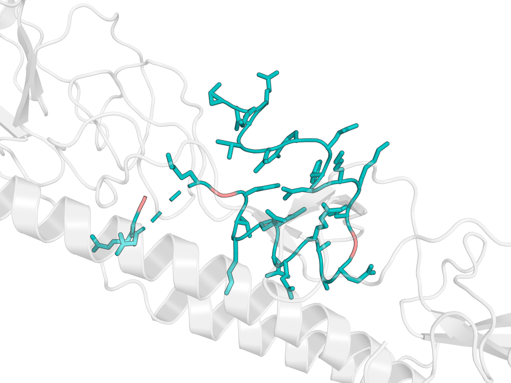
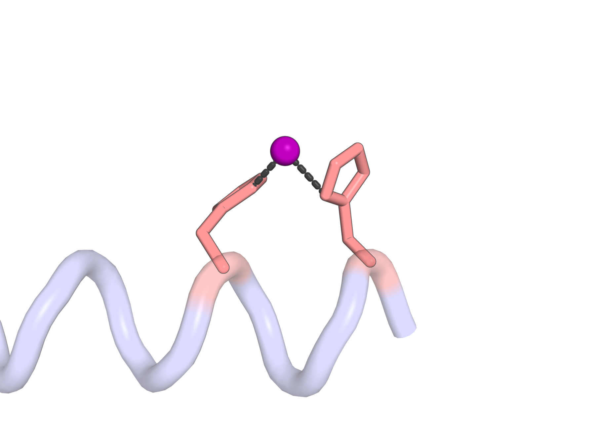
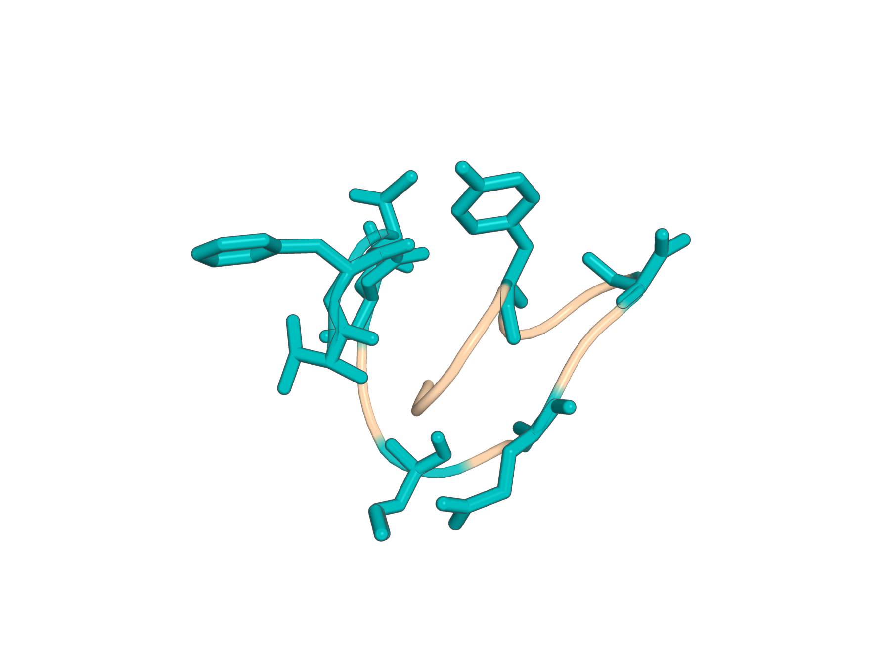
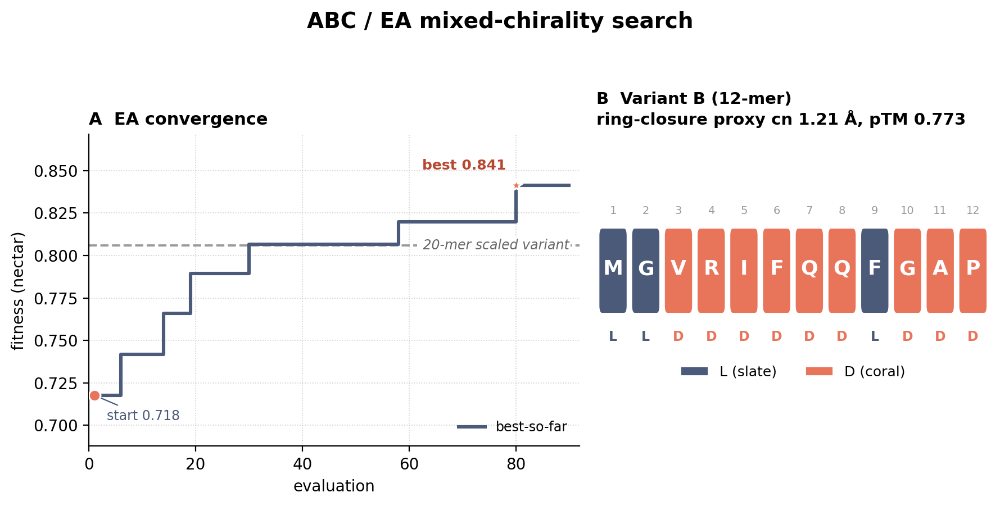

# XenoDesign1 🧬 — de novo mixed-chirality binder design on Chai-1

**XenoDesign1** designs **de novo peptide binders** — including **D-amino-acid and hetero-chiral
(mixed L/D) peptides** and **metallopeptides** — against protein, nucleic-acid, small-molecule, and
metal targets. It uses **Chai-1** (`chai_lab`) as the structure engine in a forward-only,
**HalluDesign-style** truncated-diffusion loop (**no model retraining**), with an inverse-folding
sequence-update step (LigandMPNN / CARBonAra), an adversarial judge panel for selection, and an
optional **Artificial Bee Colony (ABC) / evolutionary** search over the (identity, chirality) axes.

> Forked from [BoltzDesign1](https://github.com/yehlincho/BoltzDesign1) (MIT), but the structure engine
> is **Chai-1** (Apache-2.0), not Boltz — no Boltz/AF3 weights needed. The design loop reuses ideas from
> **HalluDesign** (MIT) and **LigandMPNN** (MIT). Fully permissive stack.

> ⚠️ **Experimental research software — NOT experimentally validated.** All designs are in-silico only.
> Open scientific items (chirality drift in single trajectories, register-specificity, weak demo
> targets) are tracked honestly in the architecture-decision record (ADR-lite) and the results notes.

---

## What it is



*XenoDesign1 design loop: seed -> (restraints) -> Chai-1 predict -> score -> select, iterated, branching per binder class with class-specific gates (chirality veto, coiled-coil periodicity, MetalHawk metal-geometry, ABC/EA mixed-chirality search).*

Three things make XenoDesign1 different from a homochiral binder designer:

1. **Mixed chirality is first-class.** Chai (like ESM/LigandMPNN) is L-biased, so the loop is
   **seeded from a chirality-correct D structure** obtained by predicting in L and reflecting it
   (the "double-flip", `xenodesign/seed.py`). D / non-canonical residues are emitted to Chai using
   the verified **parenthesis CCD** contract `(DAL)` (see `GPU_TESTS.md` → "Chai-1 input contract").

2. **From-scratch seeding.** The binder seed is **never** inherited from a reference binder's
   sequence, scaffold, or length. Lengths default per-class and are user-overridable; scaffolding
   (ICK Cys, metal coordinators) is **opt-in and declarative**, not baked in.

3. **Gated, adversarial selection.** A judge panel applies a hard **chirality veto** plus a weighted
   composite (binding / ESM-2 pseudo-log-likelihood / mirror self-consistency). Optional gates add
   coiled-coil **periodicity** (register achievability) and a **MetalHawk metal-coordination-geometry**
   check for metallopeptides.

A single unified entry point — `scripts/design.py` — dispatches all binder classes, target
chemistries, and search strategies through one shared loop.

---

## Quickstart

### 1. CPU test suite (no GPU, no Docker)

The whole pure/CPU layer (config, seeding, gates, ABC engine, restraint builders, scorers) is
unit-tested without Chai or a GPU:

```bash
PYTHONPATH=$PWD python -m pytest -m "not gpu and not network" -q
```

> On some hosts a git-excluded `tests/__init__.py` shim is needed to dodge stray user-site packages —
> see `RUNBOOK.local.md` (gitignored). Markers are declared in `pyproject.toml` (`gpu`, `network`).

### 2. A GPU design run (Docker / Singularity)

GPU work runs inside a **self-contained container** (stock `chai_lab==0.6.1` + this repo). There is
no patched-chai fork to ship — our Chai-1 changes are applied as **runtime monkeypatches**
(`xenodesign.chai_patches.ensure_patches()`), so a clean image is just chai 0.6.1 + the package.
The `Dockerfile` and `docker/xenodesign.def` (Apptainer/Singularity) build that image; **see
[`docker/README.md`](docker/README.md) for the full build/run/HPC instructions** (it is the source of
truth). The traced ESM-2 (~5.7 GB) and the HuggingFace cache (PepMLM) are **bind-mounted**, never
baked, so they are downloaded once and reused.

```bash
# Build the image (verified: builds, passes the CPU suite, runs a GPU smoke end-to-end)
docker build -t xenodesign .

# A GPU design smoke (bind the ESM + HF caches; --smoke = 3 iters / 2 seqs)
docker run --rm --gpus all \
  -v "$PWD":/work -v "$HOME"/chai_weights_cache:/chai-lab/downloads \
  -v "$HOME"/.cache/huggingface:/root/.cache/huggingface \
  xenodesign --binder_class alpha --target_type protein --smoke --out_dir /work/runs/smoke
```

**Apptainer / Singularity (HPC, e.g. SLURM clusters):** build the `.sif` with
`apptainer build --fakeroot xenodesign.sif docker-daemon://xenodesign:latest` and run with `--nv` +
bind-mounted caches and a writable `--out_dir`; a ready `sbatch` example (1 GPU/task, plus the
multi-GPU `run_parallel.py` variant) is in [`docker/README.md`](docker/README.md). The CUDA-12.1 /
torch-2.3.1 base covers V100 `sm_70` through `sm_90`, so no rebuild is needed on most cluster GPUs.

`scripts/run_design_smoke.sh` wraps the smoke for the local dev image; dual-GPU batch runs go through
`scripts/run_parallel.py` (one persistent worker per GPU, weights loaded once each). Host-specific
paths/tags for the dev box live in `RUNBOOK.local.md` (gitignored). See `GPU_TESTS.md`
for the verified Chai-1 input contract.

---

## The unified entry point: `scripts/design.py`

`scripts/design.py` is a thin front end over `xenodesign.dispatch.run_design`. It resolves a
`DesignConfig` (per-class **preset** ← `--config-file` ← CLI flags), wires the chosen binder class's
hooks into the shared loop, and prints a one-line summary.

```bash
python scripts/design.py \
    --binder_class {alpha,non_alpha,cyclic} \
    --target_type  {protein,rna,dna,small_molecule,metal,none} \
    --search       {greedy,beam,abc}
```

### Axes

| Flag | Choices | Meaning |
|---|---|---|
| `--binder_class` | `alpha`, `non_alpha`, `cyclic` | α-helical binder / non-α (ICK cystine-knot) / cyclic (Zn-macrocycle) — **required** |
| `--target_type` | `protein`, `rna`, `dna`, `small_molecule`, `metal`, `none` | target chemistry; `none` = binder-only (free peptide, intramolecular objective) |
| `--search` | `greedy`, `beam`, `abc` | greedy HalluLoop / beam+anneal / **ABC mixed-chirality** (cyclic + `none` only) |

### Key flags

| Flag | Purpose |
|---|---|
| `--binder_length N` | from-scratch binder length, clamped to **[6, 50]** (`0`/absent = per-class default: alpha 21, non_alpha 30, cyclic 24, no-target 16) |
| `--length_sweep` | run a coarse length ladder (8/12/16/24/32) and keep the best-by-objective design |
| `--coord_residues 'H6,DHI12,H18,DHI24'` | **declarative** metal coordinators: each token is identity+position; a 1-letter code (`H`) = L-residue, a CCD code (`DHI`) = D-residue. Drives both the seed's fixed positions and the metal-coordination restraint rows |
| `--cys_positions '3,7,12,18,22,26'` | non_alpha: **opt-in** ICK Cys positions (placed + drive disulfide rows); absent = no Cys scaffold |
| `--abc_variant {a,b}` | ABC axis split: `a` = search chirality, MPNN fills identity (default); `b` = search identity+chirality, MPNN warm-start only |
| `--abc_cycles`, `--colony_size`, `--scout_limit` | ABC tunables |
| `--objective {iptm,mixed,ipsae,contrastive}` | per-step design objective |
| `--backend {ligandmpnn,carbonara,mixed}` | inverse-folding backend for the sequence-update step |
| `--iters`, `--num_seqs`, `--seed`, `--device`, `--out_dir` | loop / run knobs |
| `--fasta`, `--pdb` | explicit target override (else the per-class case default) |
| `--config-file run.json` | JSON config overlay (between preset and CLI flags) |

### Gates & ablation toggles

| Flag | Effect |
|---|---|
| `--chirality_gate` | design-time acceptance gate: reject steps whose D-chirality violation exceeds threshold |
| `--periodicity_gate` | design-time gate: reject register-**unachievable** (heptad-periodic) coiled-coil binders |
| `--no_restraints` | disable restraint emission (free predict) |
| `--no_pepmlm` | disable the PepMLM target-conditioned seed |
| `--no_pll` | disable the ESM-2 pseudo-log-likelihood judge |
| `--smoke` | fast wiring check (3 iters, 2 seqs) |

> The **MetalHawk metal-geometry gate** (`xenodesign/eval/metal_geometry_gate.py`) and the entropy /
> PLL-veto judges are configured via the `gates.*` config block (`GateConfig`), off-by-default for the
> metal-geometry one; they are consulted in the cyclic class's report/selection rather than hard-wired
> into the loop. See `docs/ARCHITECTURE.md`.

### Examples

```bash
# α-helical binder vs a protein target, greedy loop
python scripts/design.py --binder_class alpha --target_type protein --search greedy

# Cyclic Zn-metallopeptide with declared coordinators (4-His tetrahedron, L/D/L/D)
python scripts/design.py --binder_class cyclic --target_type metal \
    --coord_residues 'H6,DHI12,H18,DHI24' --search greedy

# Free mixed-chirality macrocycle via ABC / evolutionary search
python scripts/design.py --binder_class cyclic --target_type none --search abc --abc_variant a

# Non-α ICK cystine-knot binder, length sweep
python scripts/design.py --binder_class non_alpha --target_type protein \
    --cys_positions '3,7,12,18,22,26' --length_sweep
```

---

## Feature overview

- **From-scratch seeding** (`seed.py`) — PepMLM target-conditioned or unconditioned random seed; the
  binder length and scaffold are never inherited from a reference binder. Double-flip produces a
  chirality-correct D seed.
- **Per-class hooks** (`classes/{alpha,non_alpha,cyclic}.py`) behind one `BinderClass` protocol
  (`classes/base.py`) — each injects seed / restraints / objective / referee / report into the
  shared loop without the dispatcher knowing the chemistry.
- **Gates / eval** (`eval/`) — Tier-0a chirality gate, design-time chirality & periodicity
  acceptance gates, the **MetalHawk metal-coordination-geometry gate**, within-Chai negative
  controls (scramble / off-target), and a chirality-reality trajectory harness.
- **D-residue Chai patches** (`chai_patches.py`) — runtime monkeypatches that repair Chai 0.6.1's
  restraint generators so coordination/contact restraints naming D / non-canonical residues actually
  apply (stock Chai silently drops them).
- **ABC / evolutionary designer** (`abc/`) — Artificial Bee Colony search over (identity, chirality)
  with structured chirality moves, a fast low-diffusion-step fitness, and A/B variants.
- **Adversarial judge panel** (`judges/`) — hard chirality veto + weighted composite (binding /
  ESM-2 PLL / mirror) for final selection.

---

## Test cases / results

De-novo validation: 4/4 binder classes produced viable Chai-1 models from scratch (no native-sequence seeding).

> ⚠️ In-silico only — these are Chai-1 predictions and search outputs, not experimental measurements. Metrics are reported verbatim, including the cases where the deposited geometry diverges from the design restraints (see the metal note below) and the ABC run for which no 3D model was deposited.

### α-helical binder (de novo, all-D)



*De-novo all-D alpha-helical binder (chain B; 20 D-residues + C-terminal Gly, teal sidechains) against an L-protein target (chain A, faded). Chai-1 ipTM 0.791; chirality gate 0.000 (vs 0.44 baseline).*

**Headline:** Chai-1 ipTM **0.791**; chirality-gate violation driven to **0.000** (baseline 0.44).

### Non-α (cystine-knot / ICK-class) binder



*De-novo non-alpha (cystine-knot / ICK-class) all-D binder (chain C, 30 aa, length-stable across all 12 design iterations) docked on a two-chain target (chains A/B, faded). Exercises the non-alpha branch + chirality gate.*

**Headline:** length-**stable across all 12 iterations** — exercises the non-α branch and chirality gate end-to-end (not an affinity claim).

### Cyclic Zn-metallopeptide (6UFA-inspired)



*Cyclic Zn-metallopeptide (chain B; 24-mer all-D), 6UFA-inspired. Chai-1 pTM 0.927; MetalHawk geometry class = tetrahedral (perplexity 1.25, PASS). The relaxed model realizes a 2-His Zn site (His19/His23, Zn-N ~2.1-2.3 A); design restraints had pinned a 4-His L/D/L/D set (His 6/12/18/24) that the sequence drifted off of -- see open issue.*

**Headline:** Chai-1 pTM **0.927**; **passed** the MetalHawk tetrahedral-geometry gate (perplexity **1.25**). Honest structural note: the deposited model realizes a **2-His** Zn site (His19/His23, Zn-N ~2.1–2.3 Å), **not** the 4-His L/D/L/D tetrahedron the restraints pinned — the sequence drifted off the restrained coordinator set (tracked as an open issue).

### Free mixed-chirality macrocycle (no target)



*Free mixed-chirality macrocycle (single chain, 16-mer; D-residues teal, Gly elsewhere). No target — intramolecular design objective. Chai-1 pTM 0.656.*

**Headline:** Chai-1 pTM **0.656** on a no-target, intramolecular objective.

### ABC / EA mixed-chirality search



*ABC/EA mixed-chirality search (Variant B, 12-mer MGVRIFQQFGAP, chirality LLDDDDDDLDDD). Fitness 0.718 -> 0.841 over 87 evaluations; 20-mer scaled variant 0.806. EA convergence + sequence/chirality map (no 3D model was deposited for this run).*

**Headline:** fitness **0.718 → 0.841** over 87 evaluations (20-mer scaled variant 0.806). This is a **sequence/search result only** — no 3D structure was deposited for this run.

---

## Running the tests

```bash
# Full CPU suite (default — fast, no GPU/network)
PYTHONPATH=$PWD python -m pytest -m "not gpu and not network" -q

# A single module
PYTHONPATH=$PWD python -m pytest tests/test_dispatch.py -q

# GPU tests (inside the self-contained image; pytest is baked in)
docker run --rm --gpus all -v "$PWD":/work \
  -v "$HOME"/chai_weights_cache:/chai-lab/downloads \
  --entrypoint python xenodesign -m pytest -m gpu -v -s -p no:cacheprovider
```

Tests are marked `gpu` (needs a GPU + `chai_lab`) and `network` (downloads a model/dataset); the
default invocation deselects both. The CPU layer is the bulk of the suite — every dispatcher seam,
gate, ABC phase, and restraint builder is exercised with fakes.

---

## Contributing

- **Read first:** `GPU_TESTS.md` (runtime contract + how-to-run) and `docs/ARCHITECTURE.md`
  (module map + data flow); the architecture-decision record (ADR-lite) captures the design rationale.
- **Style:** match the surrounding code; prefer the smallest change that works; no speculative
  abstraction. Heavy imports (torch / chai / gemmi) are **deferred to call time** so every module
  imports CPU-clean — keep it that way.
- **Tests before "done":** add or update a CPU test for any logic change and run the suite. GPU
  behaviour is validated separately in the container.
- **Adding a binder class or objective:** implement the `BinderClass` protocol (`classes/base.py`)
  and register it; or add an objective `score_fn`. See `docs/ARCHITECTURE.md` → "Extending" for the
  two plug-in points and the chain-role contract you must thread.
- **Provenance:** every run dumps `resolved_config.json` before the first predict. Don't bypass it.

## License & attribution

MIT (see `LICENSE`). Forked from **BoltzDesign1** (Cho et al., bioRxiv 2025.04.06.647261). Uses
**chai_lab** (Apache-2.0), **LigandMPNN** (MIT), **HalluDesign** (Fang et al., 2025.11.08.686881; MIT),
**PepMLM** (ChatterjeeLab; MIT), **ESM-2** (Meta), **MetalHawk** (Sgueglia/Vrettas, JCIM 2024). Catalog
from **MONDE·T** (CC-BY 4.0).
